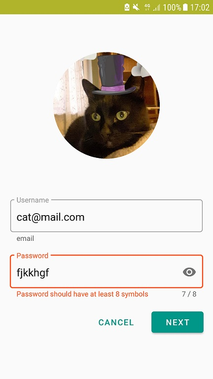

# MaterialComponentToy

In this toy project is possible to see the new functionalities of the [Material Studies](https://material.io/design/material-studies/about-our-material-studies.html) presented on the Google I/O 2018.

Code based on the Google [Codelab](https://codelabs.developers.google.com/codelabs/mdc-101-kotlin/index.html?index=..%2F..%2Findex#0)

### Log Screen

